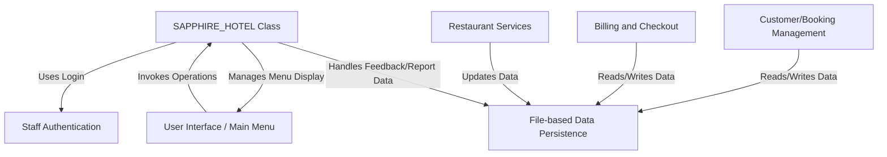

# Tutorial: Hotel-Management-System

This C++ project simulates a *Hotel Management System*. It starts with
**staff authentication** for secure access. Once logged in, staff interact
through a **main menu** to manage various hotel operations. Key functions
include **booking and managing customer stays**, adding charges for
**restaurant services**, and performing **billing and checkout**. All
customer and operational data is saved and retrieved directly from
**text files**, acting as the system's simple data storage.

## Visual Overview

## Chapters

1. [Staff Authentication
](01_staff_authentication_.md)
2. [User Interface / Main Menu
](02_user_interface___main_menu_.md)
3. [SAPPHIRE_HOTEL Class
](03_sapphire_hotel_class_.md)
4. [Customer/Booking Management
](04_customer_booking_management_.md)
5. [Restaurant Services
](05_restaurant_services_.md)
6. [Billing and Checkout
](06_billing_and_checkout_.md)
7. [File-based Data Persistence
](07_file_based_data_persistence_.md)

---

Generated by [AI Codebase Knowledge Builder](https://github.com/The-Pocket/Tutorial-Codebase-Knowledge).

