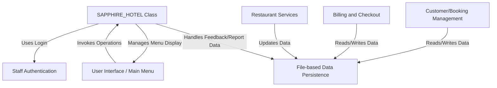
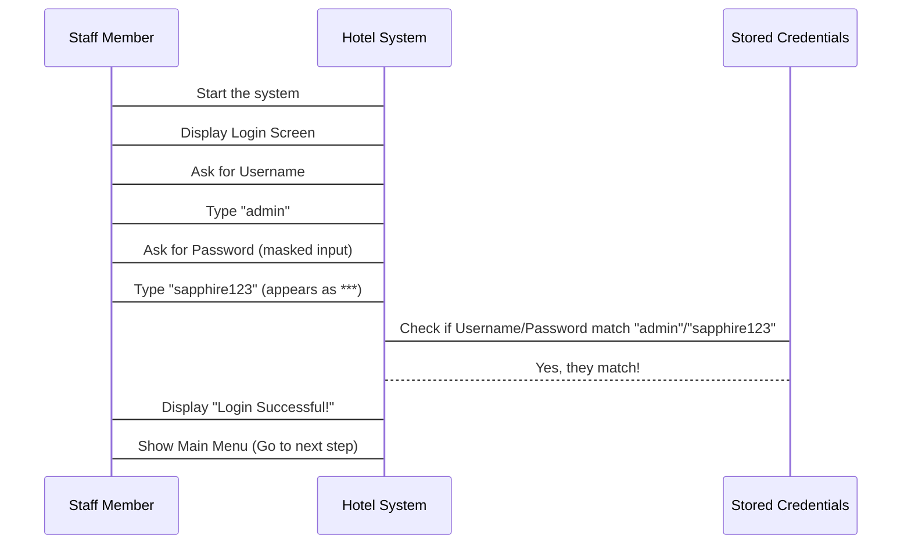
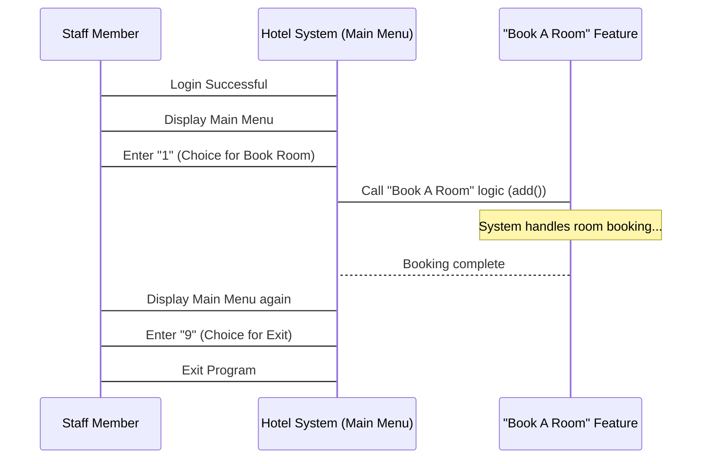
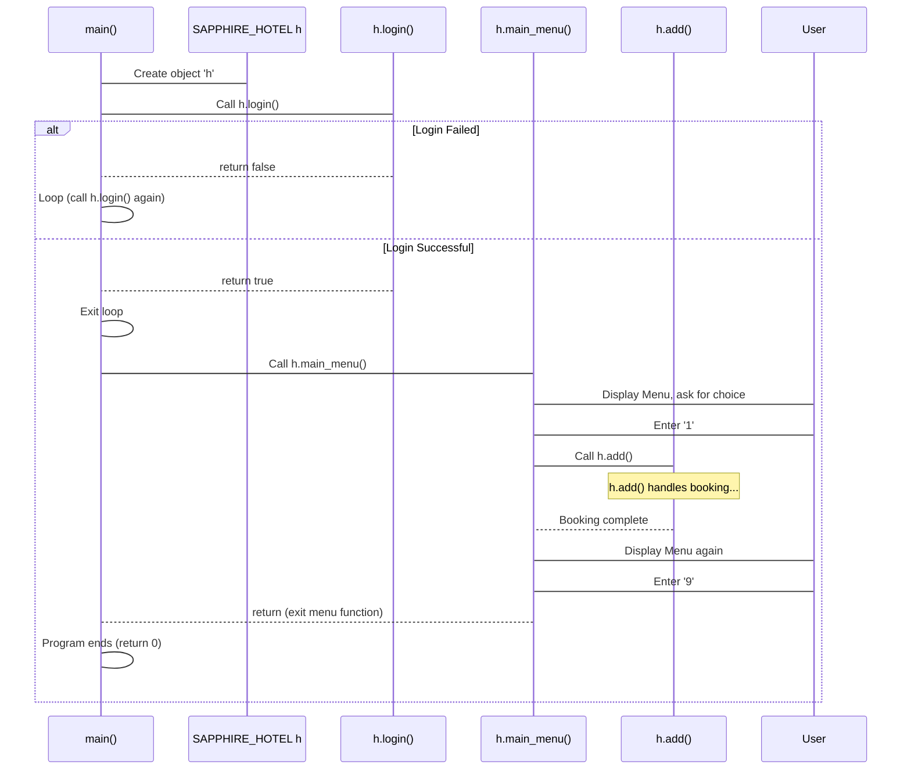
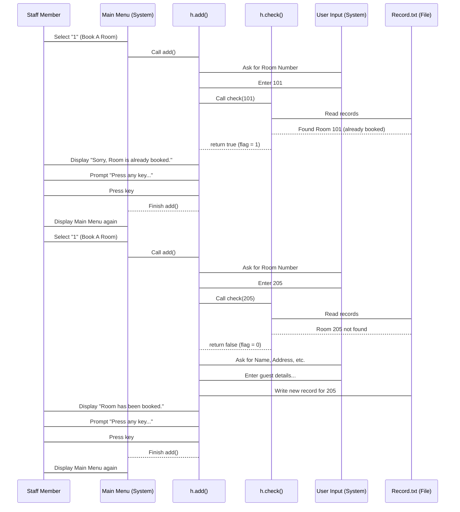
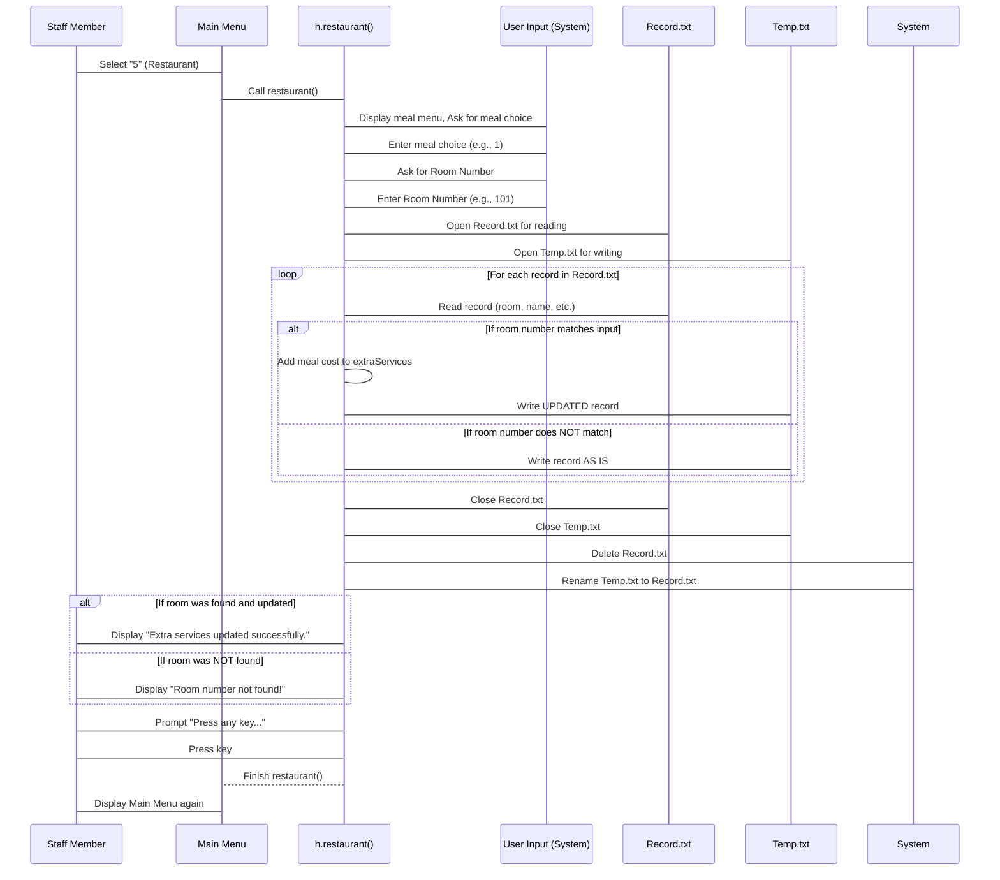
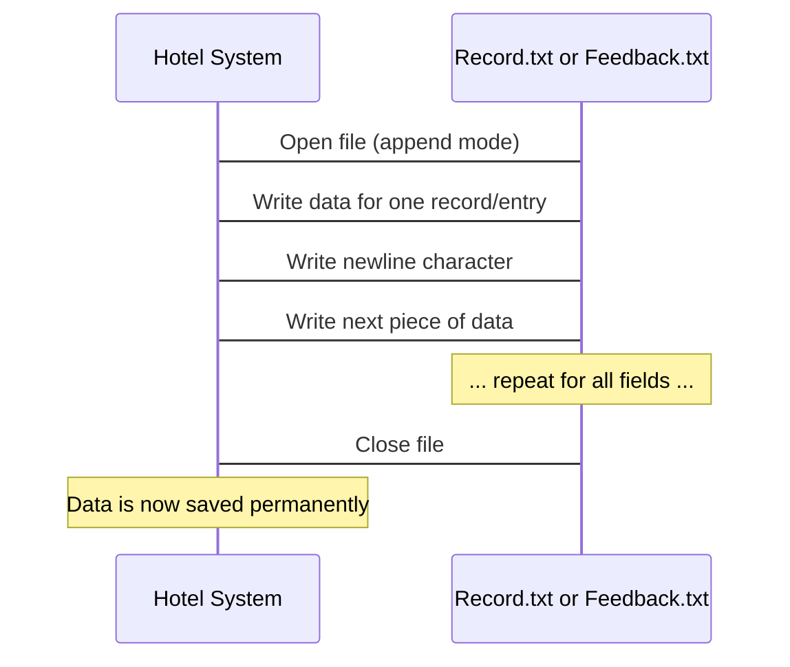
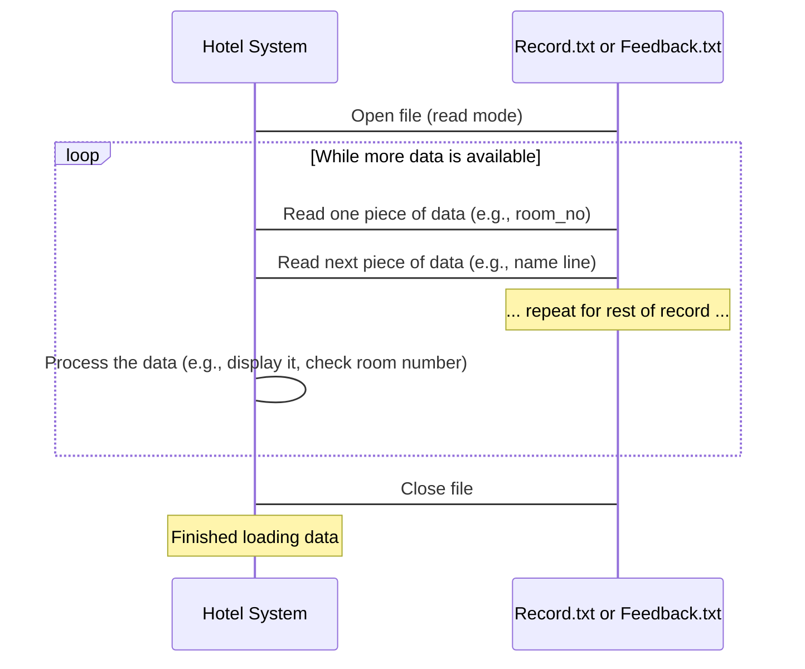
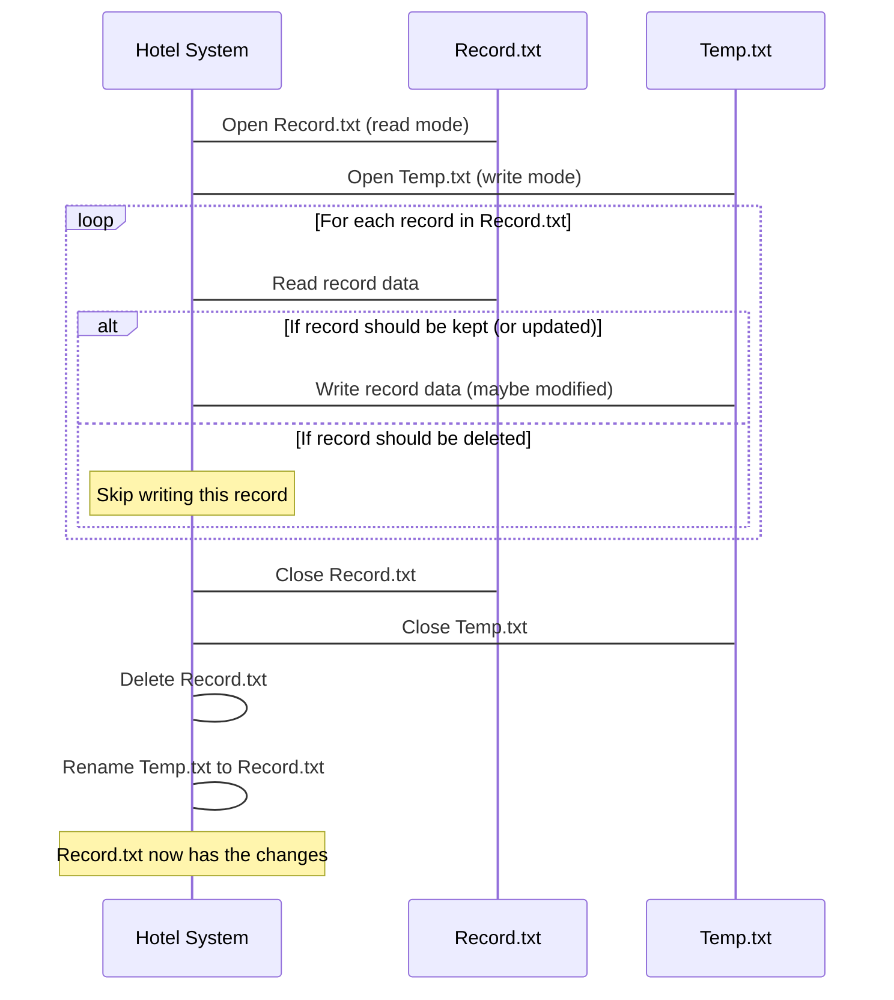

# Tutorial: Hotel-Management-System

This C++ project simulates a *Hotel Management System*. It starts with
**staff authentication** for secure access. Once logged in, staff interact
through a **main menu** to manage various hotel operations. Key functions
include **booking and managing customer stays**, adding charges for
**restaurant services**, and performing **billing and checkout**. All
customer and operational data is saved and retrieved directly from
**text files**, acting as the system's simple data storage.


## Visual Overview



## Chapters

1. [Staff Authentication
](01_staff_authentication_.md)
2. [User Interface / Main Menu
](02_user_interface___main_menu_.md)
3. [SAPPHIRE_HOTEL Class
](03_sapphire_hotel_class_.md)
4. [Customer/Booking Management
](04_customer_booking_management_.md)
5. [Restaurant Services
](05_restaurant_services_.md)
6. [Billing and Checkout
](06_billing_and_checkout_.md)
7. [File-based Data Persistence
](07_file_based_data_persistence_.md)

---

<sub><sup>Generated by [AI Codebase Knowledge Builder](https://github.com/The-Pocket/Tutorial-Codebase-Knowledge).</sup></sub>


# Chapter 1: Staff Authentication

Welcome to the first chapter of our tutorial on the `Hotel-Management-System` project! We're starting right at the beginning, just like a staff member arriving for their shift.

Imagine you walk up to the front desk at a hotel. Before you can start helping guests, booking rooms, or checking details, what's the very first thing you usually need to do? You need to show your staff ID or log into a computer system, right? This is the **Staff Authentication** step.

### What is Staff Authentication?

Think of it as the **security check** or the **front desk manager** at the entrance of our digital hotel system. Its main job is to make sure that only authorized staff members can get inside and use the system's features. Without this check, anyone could potentially access sensitive customer data or make changes to bookings, which wouldn't be very safe!

The problem this solves is simple: **How do we keep the system secure and ensure only the right people can use it?** The answer is authentication – verifying who you are.

### How It Works (The User's View)

When you first run our Hotel Management System program, it doesn't immediately jump into booking rooms or showing reports. Just like that front desk manager, it asks for your credentials.

The most common way to authenticate is with a **username** and a **password**.

1.  The system will show you a welcome message and ask for your `Username:`.
2.  You'll type in your username and press Enter.
3.  Then, it will ask for your `Password:`.
4.  As you type your password, you'll notice that instead of the actual letters, you see asterisks (`*`). This is a common security measure so someone looking over your shoulder can't see your password!
5.  You type your password and press Enter.

If the username and password you entered match what the system expects, you're granted access! You'll see a success message and then the system will take you to the main menu.

If they don't match, the system will tell you it's an invalid login, and you'll have to try again. You can keep trying until you get it right (or decide to give up!).

### A Simple Login Conversation

Let's visualize this interaction:


*(This diagram shows the back-and-forth. The staff member provides input, the system checks it, and based on the check, tells the staff member what happens next.)*

If the username or password didn't match, the `Credentials` would tell the `System` "No match!", and the `System` would tell the `User` "Invalid Credentials!" and ask for the username again, starting the process over.

### Looking at the Code

Okay, let's peek behind the curtain and see how this is handled in the C++ code.

The main part of our program starts in the `main()` function. Its first job is to make sure someone logs in.

```cpp
int main() {
    SAPPHIRE_HOTEL h; // Create an instance of our hotel system
    bool isLoggedIn = false; // Keep track if we are logged in

    // Loop until login is successful
    while (!isLoggedIn) {
        system("CLS"); // Clear the screen
        isLoggedIn = h.login(); // Call the login function
    }

    // If we reached here, login was successful!
    head(); // Display the fancy hotel header
    h.main_menu(); // Show the main menu

    return 0; // Program finished
}
```
This `main` function is quite simple for now. It creates an object `h` of the `SAPPHIRE_HOTEL` class (which holds all our hotel logic), sets a flag `isLoggedIn` to `false`, and then enters a `while` loop. This loop keeps running *as long as* `isLoggedIn` is `false`. Inside the loop, it clears the screen and calls `h.login()`.

The `login()` function (which is part of the `SAPPHIRE_HOTEL` class) does the actual work of asking for credentials and checking them. It returns `true` if the login is successful and `false` if it fails. The `main` function updates `isLoggedIn` with this result. If `login()` returns `true`, the `while` loop condition (`!isLoggedIn`) becomes `false`, and the loop stops. Then, the program continues to display the header and show the main menu.

Now, let's look at the `login()` function itself, specifically the part that handles the credentials:

```cpp
// Function to handle staff login
bool SAPPHIRE_HOTEL::login() {
    string username, password;            // Variables to store entered username and password
    string stored_username = "admin";     // Predefined valid username
    string stored_password = "sapphire123"; // Predefined valid password

    // ... (Code to display login messages) ...

    cout << "\n " << BRIGHT_WHITE << " Enter Username: " << RESET;
    cin >> username;                      // Get the username input

    cout << " " << BRIGHT_WHITE << " Enter Password: " << RESET;
    char ch;                              // Variable to store each character
    ch = _getch();                        // Get first character

    // Loop to get password input and mask it
    while (ch != 13) {                    // 13 is ASCII for Enter key
        // ... (Code to handle backspace and print '*') ...
        password.push_back(ch);       // Add character to password
        cout << '*';                  // Display '*' instead
        ch = _getch();                    // Get next character
    }

    // Check if credentials match
    if (username == stored_username && password == stored_password) {
        // ... (Success message) ...
        return true;                      // Login successful
    } else {
        // ... (Failure message) ...
        return false;                     // Login failed
    }
}
```
This is the core logic. Inside the `login` function:

1.  It declares two `string` variables, `username` and `password`, to hold what the user types.
2.  It also declares `stored_username` and `stored_password` and sets them to `admin` and `sapphire123`. These are the *only* valid credentials the system knows about for now.
3.  It prompts the user to "Enter Username:" and reads their input into the `username` variable using `cin`.
4.  It prompts for "Enter Password:".
5.  Instead of `cin`, it uses a special function `_getch()` (from `<conio.h>`). `_getch()` reads *one character at a time* from the keyboard *without* showing it on the screen immediately and *without* waiting for Enter.
6.  It enters a `while` loop that continues until the user presses the Enter key (`ch != 13`).
7.  Inside the loop, it checks if the character pressed was Backspace (code 8). If so, it removes the last character from the `password` string and erases the last `*` from the screen.
8.  If it's any other character, it adds (`push_back`) that character to the `password` string and prints a `*` on the screen to mask the input.
9.  After the loop finishes (when Enter is pressed), it compares the entered `username` with `stored_username` AND the entered `password` with `stored_password`.
10. If both match, it prints a success message, waits for the user to press a key using `_getch()` again, and returns `true`.
11. If they *don't* match, it prints a failure message and returns `false`.

This simple check is the foundation of our system's security!

### Conclusion

In this chapter, we learned about **Staff Authentication**, understanding its role as the system's gatekeeper. We saw how it requires a valid username and password before allowing access. We walked through the user experience of logging in and looked at the C++ code that handles reading the credentials, masking the password input, and comparing the entered values against hardcoded valid credentials.

Now that we know how to get into the system, the next step is to see what we can actually *do* inside!

[Next Chapter: User Interface / Main Menu](02_user_interface___main_menu_.md)

---

<sub><sup>Generated by [AI Codebase Knowledge Builder](https://github.com/The-Pocket/Tutorial-Codebase-Knowledge).</sup></sub> <sub><sup>**References**: [[1]](https://github.com/sabinikarisaman/Hotel-Management-System/blob/b6b9980b0f1c74746c18bbdde59fc5c36da107ae/main.cpp)</sup></sub>


# Chapter 2: User Interface / Main Menu

Welcome back! In our previous chapter, [Chapter 1: Staff Authentication](01_staff_authentication_.md), we learned how to securely log into the Hotel Management System, just like a staff member starting their shift. We got past the "front desk manager" of our digital system.

But what happens after you successfully log in? You don't just stare at a blank screen! You need to start working, helping guests, or managing bookings. This is where the **User Interface (UI)** and specifically the **Main Menu** come in.

### What is the User Interface / Main Menu?

Imagine you've just walked into the lobby of a large hotel. You look around for where to go next – maybe you need to check room availability, see guest details, or find the restaurant. Hotels often have clear signs or a central directory board guiding you to different areas or services.

In our Hotel Management System, the **Main Menu** is exactly like that central directory board. It's the primary screen you see after logging in, and it presents you with a clear list of everything you can do with the system. It's the core part of our **User Interface** – how you interact with the program.

The problem this solves is: **How does the staff member tell the system what task they want to perform?** The answer is the Main Menu, which acts as a central hub to navigate through the system's features.

### How It Works (The User's View)

Once you've logged in successfully, the system will clear the screen and show you the Main Menu. It will look something like this:

```text
-------------------------------------------------------------------
-------------------------------------------------------------------
			----THE GRAND SAPPHIRE HOTEL----
	-------------------------------------------------------------------
-------------------------------------------------------------------

***********************************
*         HOTEL MAIN MENU         *
***********************************
*  [1] Book A Room                *
*  [2] Customer Information       *
*  [3] Rooms Allotted             *
*  [4] Edit Customer Details      *
*  [5] Order Food from Restaurant *
*  [6] Check Out and Print Bill   *
*  [7] Feedback                   *
*  [8] Generate Report            *
*  [9] Exit                       *
***********************************

Enter Your Choice: _
```
*(Note: The colors and exact spacing might vary slightly depending on your terminal, but the layout and options are the key.)*

This list shows all the main operations you, as a staff member, can perform using the system. Each option has a number next to it (like `[1]`, `[2]`, etc.).

To choose an option, you simply type the corresponding number and press the Enter key.

*   If you type `1` and press Enter, the system will take you to the "Book A Room" feature.
*   If you type `2` and press Enter, it will show you the "Customer Information" screen.
*   If you type `9` and press Enter, you will exit the program.

If you type a number that isn't on the list (like `0` or `10`) or type something that isn't a number at all, the system will usually tell you it's an invalid choice and show the menu again, waiting for you to make a valid selection.

### A Simple Menu Interaction

Let's visualize choosing an option:


*(This diagram shows how the user picks an option, the system calls the corresponding function, and then usually returns to the menu unless the choice was 'Exit'.)*

### Looking at the Code

Okay, let's see how this is put together in the C++ code, mainly focusing on the `main_menu()` function within the `SAPPHIRE_HOTEL` class.

First, remember our `main()` function from the last chapter? After a successful login, it does this:

```cpp
int main() {
    SAPPHIRE_HOTEL h; // Create an instance of our hotel system
    bool isLoggedIn = false; // Keep track if we are logged in

    // Loop until login is successful
    while (!isLoggedIn) {
        system("CLS"); // Clear the screen
        isLoggedIn = h.login(); // Call the login function
    }

    // If we reached here, login was successful!
    head(); // Display the fancy hotel header
    h.main_menu(); // <-- THIS is where the menu starts

    return 0; // Program finished
}
```
As you can see, right after `head()` displays the hotel banner, `h.main_menu()` is called. This means the `main_menu()` function takes over from there.

Let's look at the structure of the `main_menu()` function:

```cpp
// Member function to display the main menu and handle user interactions
void SAPPHIRE_HOTEL::main_menu() {
    char choice;                         // Variable to store the user's menu choice
    bool showInvalidMsg = false;         // Flag for invalid input message

    do { // This loop makes the menu repeat
        system("CLS");                   // Clear the screen
        head();                          // Call the header function

        // Check and display invalid input message if needed
        if (showInvalidMsg) {
            cout << BRIGHT_RED << "\n\n\t\t\tInvalid input! Please enter a valid choice (1-9)." << RESET;
        }

        // --- Code to display the menu options (omitted for brevity) ---
        cout << "\n\t\t\t" << BRIGHT_YELLOW << BG_BLACK << "***********************************" << RESET;
        // ... display options [1] to [9] ...
        cout << "\n\t\t\t" << BRIGHT_YELLOW << BG_BLACK << "***********************************" << RESET << "\n";

        // Get the user's choice using a helper function
        choice = getValidInput(showInvalidMsg);
        if (choice == '\0') {            // If input is invalid ('\0' signals this)
            continue;                    // Skip the switch and loop again
        }

        // --- Code to handle the choice (switch statement) ---
        switch (choice) {
            case '1': add(); break;      // Call add function for option 1
            case '2': display(); break;  // Call display for option 2
            // ... cases 3 to 8 ...
            case '9': return;            // Exit the function (and the menu loop) for option 9
            default:                     // Should not be reached with getValidInput, but good practice
                showInvalidMsg = true;
                break;
        }
    } while (true); // Loop infinitely until 'return' is hit (by choosing '9')
}
```
Here’s what's happening:

1.  **`do { ... } while (true);`**: This creates a loop that will run *at least once* (`do`) and will continue running forever (`while (true)`) unless we specifically tell it to stop. This is how the menu keeps reappearing after you finish a task (like booking a room).
2.  **`system("CLS"); head();`**: Inside the loop, the first thing it does is clear the console and display the hotel header again. This keeps the screen looking clean for the menu.
3.  **Displaying Options**: The code then prints all the menu options using `cout`, adding color codes for formatting.
4.  **`getValidInput(showInvalidMsg);`**: This is a helper function that is called to get the user's choice. It's designed to make sure the user enters a single digit between '1' and '9'. If the input is invalid, it sets the `showInvalidMsg` flag and returns `'\0'`.
5.  **`if (choice == '\0') { continue; }`**: If `getValidInput` indicated invalid input, this `if` statement catches it. `continue` skips the rest of the loop body (the `switch` statement) and jumps straight back to the start of the `do` loop, re-displaying the menu, and this time, because `showInvalidMsg` is true, it will also show the error message.
6.  **`switch (choice)`**: If the input *was* valid (not `'\0'`), the code moves to the `switch` statement. This is like having multiple doors, and you go through the one that matches your `choice`.
7.  **`case '1': add(); break;`**: If `choice` was '1', the `add()` function (which handles booking a room) is called. `break;` is important here; it stops the `switch` statement from executing code for other cases.
8.  **`case '9': return;`**: If `choice` was '9', the `return;` statement is executed. This causes the `main_menu()` function to finish. Since `main_menu()` was called from `main()`, returning from `main_menu()` brings us back to the `main()` function, which then proceeds to `return 0;`, ending the program.
9.  **`default:`**: This case handles any other possibility in the `switch`, although `getValidInput` should prevent reaching this with an invalid choice.

Let's peek at the `getValidInput` function briefly:

```cpp
char getValidInput(bool &showInvalidMsg) {
    string input;                         // Use a string to read input first

    // If invalid input message flag is set, show an error message
    if (showInvalidMsg) {
        cout << BRIGHT_RED << "\n\n\t\t\tInvalid input! Please enter a valid choice (1-9)." << RESET;
        showInvalidMsg = false;           // Reset the flag
    }

    cout << "\n\n\t\t\t" << BRIGHT_WHITE << "Enter Your Choice: " << RESET;
    cin >> input;                         // Read input as string

    // Check if the input is exactly 1 character AND it's a digit between '1' and '9'
    if (input.length() == 1 && isdigit(input[0]) && input[0] >= '1' && input[0] <= '9') {
        return input[0];                  // Return the valid digit character
    } else {
        showInvalidMsg = true;            // Set flag for invalid input
        return '\0';                      // Return null character to signal invalidity
    }
}
```
This function is responsible for reading the user's choice and making sure it's a valid single digit between '1' and '9'. It reads the input as a string first to safely check its length and content before deciding if it's valid. If it's not valid, it sets the flag that the `main_menu` function checks to display the error message on the next loop iteration.

### Conclusion

The **User Interface / Main Menu** is the heart of our system's navigation. It's the first thing a staff member sees after logging in and provides a clear roadmap of available features. We learned that the `main_menu()` function continuously displays the options and, using a `switch` statement driven by validated input, directs the program to the correct function (`add()`, `display()`, `restaurant()`, etc.) based on the user's choice. The loop ensures the menu reappears after each task is completed, keeping the staff member in control until they choose to exit.

Now that we understand how the menu works as the central control, let's look at the overall structure that contains all these different functions and data – the `SAPPHIRE_HOTEL` class itself.

[Next Chapter: SAPPHIRE_HOTEL Class](03_sapphire_hotel_class_.md)

---

<sub><sup>Generated by [AI Codebase Knowledge Builder](https://github.com/The-Pocket/Tutorial-Codebase-Knowledge).</sup></sub> <sub><sup>**References**: [[1]](https://github.com/sabinikarisaman/Hotel-Management-System/blob/b6b9980b0f1c74746c18bbdde59fc5c36da107ae/main.cpp)</sup></sub>

# Chapter 3: SAPPHIRE_HOTEL Class

Welcome back, future hotel management expert! In our last two chapters, we learned how to log into our system ([Chapter 1: Staff Authentication](01_staff_authentication_.md)) and how to navigate the main menu that appears afterward ([Chapter 2: User Interface / Main Menu](02_user_interface___main_menu_.md)). You saw a list of tasks like "Book A Room," "Customer Information," and "Check Out."

But where do all these features *live*? How are they organized? And how does the system know which customer belongs to which room, or how much they owe? This is where the **SAPPHIRE_HOTEL Class** comes in.

### What is the SAPPHIRE_HOTEL Class?

Imagine our digital Hotel Management System is like a physical hotel building.

*   The **Staff Authentication** from Chapter 1 is like the security gate at the entrance – checking your ID before you get in.
*   The **User Interface / Main Menu** from Chapter 2 is like the lobby directory board – showing you all the different departments and services available (Front Desk, Restaurant, Billing, etc.).

Now, the **SAPPHIRE_HOTEL Class** itself is the **entire hotel building**. It's the blueprint that defines what a "Sapphire Hotel" in our system looks like and what it can do.

The problem it solves is: **How do we keep all the different parts of the hotel management system (like customer data, room details, booking logic, billing, etc.) together in one organized place?** The answer is using a **class** in programming. A class is like a template or blueprint for creating objects. Our `SAPPHIRE_HOTEL` class is the blueprint, and when we run the program, we create an *object* from this blueprint, which represents *our specific operational hotel system*.

This single `SAPPHIRE_HOTEL` object will hold all the necessary information (like a list of rooms, currently booked guests, their bills) and provide all the functions (like `add()` for booking, `display()` for showing info, `restaurant()` for ordering food) that we saw in the menu.

Think of it like this:

*   **Class:** The architectural blueprint for "Hotel". It defines rooms, elevators, lobby, offices, etc.
*   **Object:** A *specific* hotel building constructed using that blueprint. It has actual rooms, a real lobby, specific guests inside, specific staff working, etc.

In our code, `SAPPHIRE_HOTEL` is the blueprint, and the `main` function creates *one* object from this blueprint to run the entire system.

### What Does the Class Contain and Do?

A class typically has two main parts:

1.  **Data Members (What it knows):** These are variables that hold the information related to the object. In our hotel analogy, this would be things like:
    *   Details of the guest currently being processed (name, room number, address, phone, days of stay, fare, extra charges, discount).
    *   (Conceptually, although not explicitly shown as one large list in the simplified code provided yet) Information about *all* rooms and their occupancy status.
2.  **Member Functions (What it can do):** These are the functions (or methods) that perform actions related to the object. These are the operations listed in our main menu! Examples include:
    *   `add()`: To book a new room/customer.
    *   `display()`: To show customer details for a specific room.
    *   `rooms()`: To list all currently occupied rooms.
    *   `edit()`: To modify customer details or handle checkout.
    *   `restaurant()`: To add restaurant charges.
    *   `login()`: To handle staff authentication (as seen in Chapter 1).
    *   `main_menu()`: To display the menu and call other functions (as seen in Chapter 2).
    *   `check(int)`: A helper function to see if a room is available.
    *   And more...

The `SAPPHIRE_HOTEL` class declaration in our code defines these data members and member functions.

Let's look at the definition:

```cpp
// Define the class 'SAPPHIRE_HOTEL' to represent the hotel booking system
class SAPPHIRE_HOTEL {
private:
    // Private member variables to store customer and room details (for one record at a time)
    int room_no;                // Room number
    char name[30];              // Customer's name
    char address[50];           // Customer's address
    char phone[15];             // Customer's phone number
    int days;                   // Number of days the customer will stay
    float fare;                 // Total fare for the stay
    float extraServices;        // Charges for extra services
    float discount;             // Discount applied

    // Private helper functions (details not important for menu interaction)
    void breakfast();
    void lunch();
    void dinner();

public:
    // Public member functions for various features of the hotel system (accessible from outside)
    void main_menu();           // Displays the main menu
    void add();                 // Adds a new booking
    void display();             // Displays customer details
    void rooms();               // Displays allotted rooms
    void edit();                // Edits details/checkout
    int check(int);             // Checks room availability
    void modify();              // Modifies a booking
    void delete_rec();          // Deletes a booking record
    void restaurant();          // Handles restaurant services
    void applyDiscount();       // Applies discount
    void generateReport();      // Generates report
    void feedback();            // Collects feedback
    void printInvoice();        // Prints invoice/checkout
    bool login();               // Handles staff login
};
```
In this code snippet:

*   `class SAPPHIRE_HOTEL { ... };` declares our blueprint.
*   `private:` section lists things that are part of the hotel object but are generally hidden from the "outside world." These are mostly variables holding temporary data when processing *one* customer record and some internal helper functions. You can't directly access `room_no` or call `breakfast()` from outside the `SAPPHIRE_HOTEL` object.
*   `public:` section lists the functions that *can* be accessed or called from outside the object, like from the `main` function. These are the hotel's services that the staff member interacts with. This includes `login()`, `main_menu()`, and all the functions called by the menu (`add`, `display`, etc.).

### How the `main` Function Uses the `SAPPHIRE_HOTEL` Class

Now, let's revisit the `main` function from the first chapter. Its job is to start the program. How does it start our hotel system? By creating an object of the `SAPPHIRE_HOTEL` class and then telling that object to start its work.

```cpp
int main() {
    SAPPHIRE_HOTEL h; // Create an instance (an object) of our hotel system

    bool isLoggedIn = false; // Keep track if we are logged in

    // Loop until login is successful, handled by the 'h' object
    while (!isLoggedIn) {
        system("CLS"); // Clear the screen
        isLoggedIn = h.login(); // Call the login function *on the 'h' object*
    }

    // If we reached here, login was successful!
    head(); // Display the fancy hotel header

    h.main_menu(); // Show the main menu *using the 'h' object*

    return 0; // Program finished
}
```
Look at the line `SAPPHIRE_HOTEL h;`. This is like saying, "Okay, based on the `SAPPHIRE_HOTEL` blueprint, build me an actual, working hotel instance and let's call it `h`."

Once we have the `h` object, we can tell it to do things by calling its **public** member functions using the dot (`.`) operator:

*   `h.login();`: We tell the `h` object to perform its `login` action.
*   `h.main_menu();`: After logging in, we tell the `h` object to display and manage the `main_menu`.

When `h.main_menu()` is running, if you choose option '1', the `main_menu` function (which is inside the `h` object) will then call another function *inside the same `h` object*, namely `h.add()`, to handle the room booking. All the actions happen *within* the context of this single `h` object, which represents our running hotel system.

### Flow of Execution

Here's a simple diagram showing how the program flow involves the `SAPPHIRE_HOTEL` object:


This diagram shows that the `main` function is just the starting point. It creates the `SAPPHIRE_HOTEL` object (`h`), and then passes control to its methods (`login`, `main_menu`). All the actual work of the hotel system happens *within* the methods of the `h` object.

### Conclusion

In this chapter, we explored the core of our project's structure: the **SAPPHIRE_HOTEL Class**. We learned that it acts as the main blueprint for the entire system, organizing all the data (customer details, room info) and all the actions (booking, displaying, billing) into a single, cohesive unit. The `main` function simply creates an instance of this class and tells it to start running the `login` and `main_menu` functions. All the subsequent interactions we saw in the menu happen by calling different functions defined within this `SAPPHIRE_HOTEL` object.

Now that we understand the container, let's start looking inside and see how one of the key functions, like managing customers and their bookings, is handled within the `SAPPHIRE_HOTEL` class.

[Next Chapter: Customer/Booking Management](04_customer_booking_management_.md)

---

<sub><sup>Generated by [AI Codebase Knowledge Builder](https://github.com/The-Pocket/Tutorial-Codebase-Knowledge).</sup></sub> <sub><sup>**References**: [[1]](https://github.com/sabinikarisaman/Hotel-Management-System/blob/b6b9980b0f1c74746c18bbdde59fc5c36da107ae/main.cpp)</sup></sub>

# Chapter 4: Customer/Booking Management

Welcome back! In the last few chapters, we've set up our Hotel Management System. We learned how to securely log in ([Chapter 1: Staff Authentication](01_staff_authentication_.md)), navigate the main menu to see the available options ([Chapter 2: User Interface / Main Menu](02_user_interface___main_menu_.md)), and understood that all these features are neatly organized within the `SAPPHIRE_HOTEL` class ([Chapter 3: SAPPHIRE_HOTEL Class](03_sapphire_hotel_class_.md)).

Now that we're inside the system and know where everything is, it's time to tackle the core business of any hotel: managing guests and their stays!

### What is Customer/Booking Management?

Think of the front desk and the reservation system working together. This part of our software is like that central hub. Its main job is to handle everything related to who is staying in which room, for how long, and their basic details.

The problem it solves is fundamental: **How do we keep track of guests and their room bookings from arrival to departure?** This involves several key tasks:

*   Adding a new guest's reservation when they check in.
*   Finding and viewing a guest's information quickly.
*   Making changes to a booking (like extending a stay).
*   Checking which rooms are occupied or available.
*   Handling a guest checking out.

All these actions are managed by specific functions within our `SAPPHIRE_HOTEL` class. You saw them listed in the main menu!

### Core Functions for Customer & Booking Management

Let's look at the main functions in the `SAPPHIRE_HOTEL` class that handle these tasks:

| Menu Option                     | Function Name | What it Does                                                                 | Analogy                     |
| :------------------------------ | :------------ | :--------------------------------------------------------------------------- | :-------------------------- |
| `[1] Book A Room`               | `add()`       | Records details for a new guest and books a room.                            | Filling a check-in form     |
| `[2] Customer Information`      | `display()`   | Finds and shows details for a guest in a specific room.                      | Looking up a reservation    |
| `[3] Rooms Allotted`            | `rooms()`     | Lists all rooms currently occupied by guests.                                | Checking the occupied rooms list |
| `[4] Edit Customer Details`     | `edit()`      | Offers options to `modify()` a booking or handle checkout (via `delete_rec`). | Updating guest info or starting checkout |
| (Called by `add` & `modify`)    | `check(int)`  | Checks if a given room number is already booked.                             | Checking a room's status    |
| (Called by `edit`)              | `modify()`    | Allows changing details of an existing guest booking.                      | Amending a reservation      |
| (Called by `edit` or `printInvoice`) | `delete_rec()`| Removes a guest's record, typically during checkout.                         | Removing a reservation card |

These functions work together to provide the front desk functionality. Let's explore how some of the key ones work.

### Booking a New Room (`add()`)

When a new guest arrives, the first thing you do is book them into a room. This corresponds to menu option `[1] Book A Room`, which calls the `add()` function.

Imagine this conversation:


*(This diagram shows two scenarios: trying to book a room that's taken, and successfully booking an available room.)*

The `add()` function does the following:

1.  It clears the screen and shows the header.
2.  It asks the staff member for the room number they want to book.
3.  **Important:** It calls the `check()` function to see if that room is already occupied.
4.  If `check()` says the room is taken, it prints a message and stops.
5.  If `check()` says the room is available, it asks for all the guest's details (name, address, phone, days of stay).
6.  It calculates the basic fare based on the number of days (Rs 900 per day in this system).
7.  It calls `applyDiscount()` (which we'll look at briefly) to see if the guest qualifies for a discount.
8.  Finally, it saves all this information into a file named "Record.txt" and confirms the booking.

Let's look at simplified code snippets from `add()` and its helper `check()`:

```cpp
// Inside SAPPHIRE_HOTEL class
void SAPPHIRE_HOTEL::add() {
    system("CLS"); head(); // Clear screen, show header
    int r; // Room number variable

    // Ask for room number & validate input (Simplified for brevity)
    // ... input validation code using stoi and try-catch ...
    int num = 0; /* Assume num gets valid integer input */
    r = num;

    int flag = check(r); // Check if the room is booked

    if (flag) { // If room is booked (flag is 1)
        cout << BRIGHT_RED << "\n Sorry, Room is already booked." << RESET;
    } else { // If room is available (flag is 0)
        room_no = r; // Store the room number for this booking

        // Get other customer details (Name, Address, Phone, Days)
        cout << " " << BRIGHT_WHITE << "Name: " << RESET;
        cin.ignore(); // Clear input buffer
        cin.getline(name, 30); // Read name
        // ... similar lines for address, phone, days ...
        cout << " " << BRIGHT_WHITE << "Number of Days: " << RESET;
        cin >> days;

        fare = days * 900; // Calculate fare
        extraServices = 0.0; // Start with no extra charges
        applyDiscount(); // Apply discount based on days

        // Save details to file (simplified)
        ofstream fout("Record.txt", ios::app); // Open file in append mode
        fout << room_no << endl;
        fout << name << endl;
        fout << address << endl;
        fout << phone << endl;
        fout << days << endl;
        fout << fare << endl;
        fout << extraServices << endl; // Save extra services
        fout << discount << endl; // Save discount
        fout.close();

        cout << BRIGHT_GREEN << "\n Room has been booked." << RESET;
    }

    cout << "\n Press any key to continue."; getch();
}
```
This snippet shows the main steps: getting the room number, calling `check()`, getting guest details, calculating fare/discount, and writing the data to "Record.txt".

Now let's look at the `check()` function:

```cpp
// Inside SAPPHIRE_HOTEL class
int SAPPHIRE_HOTEL::check(int r) {
    int flag = 0; // Assume room is NOT found (0) initially
    ifstream fin("Record.txt"); // Open the record file for reading

    // Loop through each record in the file
    while (fin >> room_no) { // Read the room number first
        // Read the rest of the record for THIS room number (even if we don't use it here)
        fin.ignore(); fin.getline(name, 30); fin.getline(address, 50);
        fin.getline(phone, 15); fin >> days >> fare >> extraServices >> discount;
        fin.ignore(); // Ignore newline after reading discount

        if (room_no == r) { // Check if the room number matches the one we're looking for
            flag = 1; // If found, set flag to 1
            break; // Stop reading the file, we found it
        }
    }

    fin.close(); // Close the file
    return flag; // Return 1 if found (booked), 0 if not found (available)
}
```
The `check()` function reads through the "Record.txt" file. For each record, it checks if the stored `room_no` matches the number `r` that was passed to the function. If it finds a match, it sets `flag` to 1 and stops. If it goes through the whole file without finding a match, `flag` remains 0. This is how the system knows if a room is already occupied.

The `applyDiscount()` function is simple:

```cpp
// Inside SAPPHIRE_HOTEL class
void SAPPHIRE_HOTEL::applyDiscount() {
    // Check if the guest is staying for more than 7 days
    if (days > 7) {
        discount = fare * 0.10; // Apply a 10% discount on the calculated fare
    } else {
        discount = 0; // No discount if stay is 7 days or less
    }
}
```
This function is called by `add()` and `modify()` to calculate the `discount` value based on the number of `days` the guest is staying.

### Viewing Customer Information (`display()`)

After a guest is checked in, you often need to look up their details – maybe they forgot their room number, or you need to confirm their phone number. This is done via menu option `[2] Customer Information`, which calls the `display()` function.

```cpp
// Inside SAPPHIRE_HOTEL class
void SAPPHIRE_HOTEL::display() {
    system("CLS"); head(); // Clear screen, show header
    ifstream fin("Record.txt"); // Open the records file for reading

    int r; // Room number to search for
    int flag = 0; // Flag to indicate if room is found

    cout << BRIGHT_BLUE << "\n Enter Room Number:" << RESET;
    cin >> r; // Get room number from user

    // Loop through each record in the file
    while (fin >> room_no) { // Read room number
        // Read the rest of the record
        fin.ignore(); fin.getline(name, 30); fin.getline(address, 50);
        fin.getline(phone, 15); fin >> days >> fare >> extraServices >> discount;
        fin.ignore();

        if (room_no == r) { // Check if this record matches the room number entered
            system("CLS"); head(); // Clear again to show clean details
            cout << BRIGHT_MAGENTA << "\n Customer Details " << RESET;
            cout << "\n ---------------- " << RESET;
            // Print all the details stored for this record
            cout << "\n\n " << BRIGHT_WHITE << "Room Number: " << room_no;
            cout << "\n " << BRIGHT_WHITE << "Name: " << name;
            cout << "\n " << BRIGHT_WHITE << "Address: " << address;
            cout << "\n " << BRIGHT_WHITE << "Phone Number: " << phone;
            cout << "\n " << BRIGHT_WHITE << "Staying for " << days << " days.";
            cout << "\n " << BRIGHT_WHITE << "Extra Services Charges: Rs " << extraServices;
            // Calculate and display total bill (fare - discount + extra)
            cout << "\n " << BRIGHT_WHITE << "Total Amount (estimate): Rs " << fare - discount + extraServices;

            flag = 1; // Set flag: record found
            break; // Stop searching
        }
    }

    if (flag == 0) { // If flag is still 0 after the loop
        cout << BRIGHT_RED << "\n Room not found." << RESET;
    }

    cout << "\n\n Press any key to continue."; getch();
    fin.close(); // Close the file
}
```
The `display()` function works by opening "Record.txt" and reading *every* record, one by one. It compares the `room_no` of the current record being read from the file with the room number the user typed. If it finds a match, it prints all the stored details for that record and stops searching. If it reads the whole file without finding the room number, it displays a "Room not found" message.

### Listing Occupied Rooms (`rooms()`)

Sometimes you just need a quick overview of which rooms are currently occupied. Menu option `[3] Rooms Allotted` does this by calling the `rooms()` function.

```cpp
// Inside SAPPHIRE_HOTEL class
void SAPPHIRE_HOTEL::rooms() {
    system("CLS"); head(); // Clear screen, show header
    ifstream fin("Record.txt"); // Open the records file for reading

    cout << BRIGHT_YELLOW << "\n\t\t\t List Of Rooms Allotted" << RESET;
    cout << "\n\t\t\t -----------------------" << RESET;

    // Loop through *all* records in the file
    while (fin >> room_no) { // Read room number
        // Read the rest of the record (name, address, etc.)
        fin.ignore(); fin.getline(name, 30); fin.getline(address, 50);
        fin.getline(phone, 15); fin >> days >> fare >> extraServices >> discount;
        fin.ignore();

        // Print details for *each* record found
        cout << "\n " << BRIGHT_WHITE << "Room Number: " << room_no;
        cout << "\n " << BRIGHT_WHITE << "Name: " << name;
        cout << "\n " << BRIGHT_WHITE << "Phone: " << phone; // Maybe just show key details
        // ... potentially print other details ...
        cout << "\n**********************************"; // Separator

    } // Loop continues until end of file

    cout << "\n\n\t\t\tPress any key to continue."; getch();
    fin.close(); // Close the file
}
```
The `rooms()` function is similar to `display()`, but instead of searching for one room, it reads and prints details (or a summary) for *every* record found in the "Record.txt" file, effectively listing all booked rooms.

### Editing or Checking Out (`edit()`)

Menu option `[4] Edit Customer Details` leads to a sub-menu handled by the `edit()` function. This is the gateway to changing a booking or starting the checkout process.

```cpp
// Inside SAPPHIRE_HOTEL class
void SAPPHIRE_HOTEL::edit() {
    system("CLS"); head(); // Clear screen, show header
    int choice, r; // User's choice in edit menu, Room number

    cout << BRIGHT_BLUE << "\n EDIT MENU" << RESET;
    cout << "\n ---------" << RESET;
    cout << "\n\n " << BRIGHT_WHITE << "1. Modify Customer Information.";
    cout << "\n " << BRIGHT_WHITE << "2. Customer Check Out.";
    cout << "\n " << BRIGHT_WHITE << "Enter your choice: " << RESET;
    cin >> choice; // Get choice (1 or 2)

    system("CLS"); head(); // Clear again
    cout << BRIGHT_WHITE << "\n Enter Room Number: " << RESET;
    cin >> r; // Get the room number the user wants to edit

    switch (choice) {
        case 1:
            room_no = r; // Set the class's room_no variable to the entered room
            modify(); // Call the modify function
            break;
        case 2:
            room_no = r; // Set the class's room_no variable to the entered room
            delete_rec(); // Call the delete_rec function
            break;
        default:
            cout << BRIGHT_RED << "\n Wrong Choice." << RESET;
    }

    cout << "\n Press any key to continue."; getch();
    // File handling for modify/delete is inside those functions
}
```
The `edit()` function is simple; it presents a choice (Modify or Checkout), gets the room number, and then calls either `modify()` or `delete_rec()` based on the user's selection. Notice it sets the `room_no` member variable *before* calling `modify()` or `delete_rec()`. This is how `modify()` and `delete_rec()` know which room's record to operate on.

### Modifying a Booking (`modify()`)

If a guest wants to change their details or extend their stay, you use the `modify()` function (called via the `edit()` menu). This is a bit trickier because you need to find the record, update it, and save it back *in the same place* in the file.

```cpp
// Inside SAPPHIRE_HOTEL class
void SAPPHIRE_HOTEL::modify() {
    // Open file for reading AND writing, starting at the end (ate)
    fstream file("Record.txt", ios::in | ios::out | ios::ate);
    file.seekg(0); // Move read pointer back to the beginning

    long pos; // To store the position of the record
    int flag = 0; // Flag if room is found and modified

    // Loop through records
    while (file >> room_no) {
        pos = file.tellg(); // Save position *before* reading THIS record
        // Read the rest of the record
        file.ignore(); file.getline(name, 30); file.getline(address, 50);
        file.getline(phone, 15); file >> days >> fare >> extraServices >> discount;
        file.ignore();

        // Check if this record's room number matches the one from edit()
        if (room_no == this->room_no) { // Use this->room_no to refer to the class member
            system("CLS"); head(); // Clear screen
            cout << BRIGHT_BLUE << "\n Enter New Details " << RESET;
            cout << "\n ----------------- " << RESET;
            // Prompt for NEW details
            cout << " " << BRIGHT_WHITE << "\n\nName: " << RESET;
            cin.ignore(); // Need another ignore after reading the room number in edit()
            cin.getline(name, 30); // Read new name
            // ... similar lines for address, phone ...
            cout << " " << BRIGHT_WHITE << "Number of Days: " << RESET;
            cin >> days; // Read new number of days

            fare = days * 900; // Recalculate fare based on new days
            // extraServices remains as is unless modified separately
            applyDiscount(); // Re-apply discount based on new days

            // Move write pointer back to the start of THIS record
            // We saved the start position using pos = file.tellg() BEFORE reading.
            // After reading the whole record, the pointer is *after* it.
            // We need to calculate how much to move back based on the size of the data read.
            // This calculation can be tricky with variable-length strings and newlines.
            // A simpler conceptual way is needed for beginners.
            // Let's simplify the explanation and focus on the *intent* of seekp(pos).
            file.seekp(pos - /* estimated size of the record read */ 0); // simplified seekp

            // Write the *updated* details back to the file at that position
            file << room_no << endl; // Write room number (same)
            file << name << endl;    // Write new name
            file << address << endl; // Write new address
            file << phone << endl;   // Write new phone
            file << days << endl;    // Write new days
            file << fare << endl;    // Write new fare
            file << extraServices << endl; // Write extra services
            file << discount << endl; // Write new discount

            cout << BRIGHT_GREEN << "\n Record Modified." << RESET;
            flag = 1; // Set flag: record modified
            break; // Stop searching/modifying
        }
    }

    if (flag == 0) {
        cout << BRIGHT_RED << "\n Room not found." << RESET;
    }

    // "Press any key..." is after the switch in edit()
    file.close();
}
```
The `modify()` function uses `fstream` to read and write to the same file. The key is reading a record, *remembering the position* (`tellg()`) before reading it, getting the new details, and then moving the file pointer *back* to that remembered position (`seekp()`) before writing the *new* data over the old data. The complexity of calculating the exact seek position with variable-length lines is abstracted for this beginner explanation.

### Checking Out / Deleting a Record (`delete_rec()`)

When a guest checks out, their record needs to be removed from the list of active guests. Menu option `[4] Edit Customer Details` option 2 calls `delete_rec()`. Note that the full checkout process including printing a bill (Menu option `[6]`) also involves removing the record after payment is confirmed, as we will see in [Chapter 6: Billing and Checkout](06_billing_and_checkout_.md). Here, we focus on the record *removal* mechanism.

This is done by a common technique: copy the data you want to keep to a *new* temporary file, then replace the original file with the temporary one.

```cpp
// Inside SAPPHIRE_HOTEL class
void SAPPHIRE_HOTEL::delete_rec() {
    system("CLS"); head(); // Clear screen, show header

    int r = this->room_no; // Get the room number passed from edit() or printInvoice()
    int flag = 0; // Flag if room was found and will be 'deleted'

    cout << BRIGHT_WHITE << "\n Processing checkout for Room: " << r << RESET;

    ifstream fin("Record.txt"); // Open original file for reading
    ofstream fout("Temp.txt");  // Open temporary file for writing

    // Loop through each record in the original file
    while (fin >> room_no) { // Read room number
        // Read the rest of the record
        fin.ignore(); fin.getline(name, 30); fin.getline(address, 50);
        fin.getline(phone, 15); fin >> days >> fare >> extraServices >> discount;
        fin.ignore();

        // Check if this is the record we want to delete
        if (room_no == r) {
            cout << BRIGHT_GREEN << "\n Room found, marking for deletion." << RESET;
            flag = 1; // Set flag: room found
            // **DO NOT** write this record to Temp.txt - this is the 'deletion'
        } else {
            // If it's NOT the record to delete, write it to the temporary file
            fout << room_no << endl;
            fout << name << endl;
            fout << address << endl;
            fout << phone << endl;
            fout << days << endl;
            fout << fare << endl;
            fout << extraServices << endl;
            fout << discount << endl;
        }
    }

    fin.close(); // Close original file
    fout.close(); // Close temporary file

    // Now, replace the original file with the temporary one
    remove("Record.txt");       // Delete the original file
    rename("Temp.txt", "Record.txt"); // Rename the temporary file to the original name

    if (flag == 0) { // If flag is still 0, the room wasn't found
        cout << BRIGHT_RED << "\n Room not found or was already vacant." << RESET;
    } else {
         cout << BRIGHT_GREEN << "\n Checkout complete. Record removed." << RESET;
         // Note: Actual billing happens in printInvoice() in Chapter 6
    }

    // "Press any key..." is after the switch in edit()
    // and within printInvoice() for the main checkout path.
}
```
The `delete_rec()` function reads every record from "Record.txt". If the record's room number matches the room being checked out, it simply *doesn't* write that record to the new "Temp.txt" file. All other records *are* written to "Temp.txt". Finally, it deletes the original "Record.txt" and renames "Temp.txt" to "Record.txt". The result is that the original file is replaced by a new file that contains all records *except* the one that was 'deleted'.

### Conclusion

In this chapter, we dived into the heart of the Hotel Management System: **Customer/Booking Management**. We learned that functions like `add()`, `display()`, `rooms()`, `edit()`, `modify()`, `check()`, and `delete_rec()` are the tools staff use at the front desk. We saw how `add()` books a room (after checking availability with `check()`) by writing to a file, how `display()` and `rooms()` read from that file to show guest information, how `modify()` carefully updates a record in place, and how `delete_rec()` removes a record by effectively rebuilding the file without it.

These functions rely on simple file operations to store and retrieve data, which we'll cover in more detail later. But for now, you understand the basics of how the system keeps track of its guests!

Next, let's explore another important service: managing orders from the restaurant.

[Next Chapter: Restaurant Services](05_restaurant_services_.md)

---

<sub><sup>Generated by [AI Codebase Knowledge Builder](https://github.com/The-Pocket/Tutorial-Codebase-Knowledge).</sup></sub> <sub><sup>**References**: [[1]](https://github.com/sabinikarisaman/Hotel-Management-System/blob/b6b9980b0f1c74746c18bbdde59fc5c36da107ae/Record.txt), [[2]](https://github.com/sabinikarisaman/Hotel-Management-System/blob/b6b9980b0f1c74746c18bbdde59fc5c36da107ae/main.cpp)</sup></sub>

# Chapter 5: Restaurant Services

Welcome back, and hopefully you're feeling a little hungry! In our journey through the Hotel Management System, we've learned how to log in securely ([Chapter 1: Staff Authentication](01_staff_authentication_.md)), navigate the system using the main menu ([Chapter 2: User Interface / Main Menu](02_user_interface___main_menu_.md)), understood that the `SAPPHIRE_HOTEL` class is the container for everything ([Chapter 3: SAPPHIRE_HOTEL Class](03_sapphire_hotel_class_.md)), and mastered the basics of adding and managing guest bookings ([Chapter 4: Customer/Booking Management](04_customer_booking_management_.md)).

Now, let's look at how our system handles one of the convenient services a hotel provides: ordering food directly to the room.

### What are Restaurant Services?

Imagine a guest calls the front desk or uses a system in their room to order breakfast, lunch, or dinner. As a staff member using our system, you need a way to record this order and make sure the cost is added to the guest's bill so it's paid when they check out.

The **Restaurant Services** module (handled by the `restaurant()` function in our system) is like the digital bridge between the hotel kitchen and the guest's bill. It allows staff to select a food item ordered by a guest and automatically add the corresponding charge to that guest's record.

The problem this solves is: **How do we track extra expenses like room service food orders and ensure they are included in the guest's final bill?** The `restaurant()` function manages this by updating the guest's account with these additional costs.

### How It Works (The User's View)

As a staff member, when a guest orders food via room service, you would typically do the following in the system:

1.  From the **Hotel Main Menu**, select option `[5] Order Food from Restaurant`.
2.  The system will clear the screen and display a simple menu of available meals (Breakfast, Lunch, Dinner) and their prices.
3.  You will be asked to **Enter Your Choice** for the meal the guest ordered (e.g., `1` for Breakfast).
4.  Next, the system asks you to **Enter Room Number** of the guest who placed the order.
5.  You enter the room number and press Enter.
6.  If the room number is found, the system confirms that the extra service charges have been updated.
7.  If the room number is not found (maybe the guest already checked out or entered it incorrectly), the system informs you.
8.  The system then waits for you to press a key and returns you to the **Hotel Main Menu**.

The cost of the ordered meal is now added to the `extraServices` charge stored in that guest's record, ready to be included in their final bill later.

### Core Function: `restaurant()`

The main function in our `SAPPHIRE_HOTEL` class that handles this entire process is `restaurant()`. Let's look at its public declaration in the class definition:

```cpp
class SAPPHIRE_HOTEL {
private:
    // ... other private members ...
    float extraServices;        // Charges for extra services (like food)

    // Private member functions for meal options (called by restaurant())
    void breakfast();
    void lunch();
    void dinner();

public:
    // ... other public members ...
    void restaurant();          // Handles restaurant services
    // ... rest of public members ...
};
```
Notice that `restaurant()` is `public` (callable from the main menu), while `breakfast()`, `lunch()`, and `dinner()` are `private`. This suggests that `restaurant()` is the main entry point for the user, and it uses the private functions internally (though as we'll see, the current code structure handles charges directly in `restaurant()`). The `extraServices` variable, which is part of *each* guest's record, is where these food charges are added.

### How it Works Internally (Walkthrough)

When you select option `[5]` and the `restaurant()` function is called, here's a simplified look at what happens behind the scenes:

1.  **Display Menu:** The function first prints the options for Breakfast, Lunch, and Dinner on the screen.
2.  **Get Meal Choice:** It asks the staff member to choose a meal (1, 2, or 3) and stores this choice.
3.  **Determine Charge:** Based on the choice, it figures out the cost of that meal (Rs 200, 500, or 700).
4.  **Get Room Number:** It asks the staff member for the room number of the guest who ordered the food.
5.  **Find Guest Record:** The system needs to find the specific guest's record in the `Record.txt` file that corresponds to the entered room number.
6.  **Update Charges:** *Crucially*, when it finds the correct record, it adds the determined meal cost to the `extraServices` value stored for *that specific guest*.
7.  **Save Changes:** Just like modifying or deleting a record ([Chapter 4: Customer/Booking Management](04_customer_booking_management_.md)), the system has to rewrite the file. It reads *all* records, writes them one by one to a temporary file (`Temp.txt`), but when it encounters the target guest's record, it writes the *updated* version (with the new `extraServices` total) to `Temp.txt`.
8.  **Replace File:** After processing all records, the original `Record.txt` is deleted, and `Temp.txt` is renamed to `Record.txt`. This new file contains the updated `extraServices` for the guest who ordered food.

Here's a diagram showing the flow:



### Looking at the Code (`restaurant()`)

Let's look at the `restaurant()` function code to see this in action:

```cpp
void SAPPHIRE_HOTEL::restaurant() {
    int choice; // Variable to store the user's choice for meal type

    // Clear the screen and display the header
    system("CLS");
    head();

    // Display restaurant menu options with colors
    cout << BRIGHT_YELLOW << BG_BLACK;
    cout << "\n\t\t\t\t**************";
    cout << "\n\t\t\t\t* RESTAURANT *";
    cout << "\n\t\t\t\t**************" << RESET;

    // Display meal options with prices
    cout << "\n\n\n\t\t\t" << BRIGHT_WHITE << BG_BLACK << "1. Breakfast (Rs 200/-)" << RESET;
    cout << "\n\t\t\t" << BRIGHT_WHITE << BG_BLACK << "2. Lunch (Rs 500/-)" << RESET;
    cout << "\n\t\t\t" << BRIGHT_WHITE << BG_BLACK << "3. Dinner (Rs 700/-)" << RESET;

    cout << "\n\n\t\t\t" << BRIGHT_WHITE << "Enter Your Choice: " << RESET; // Prompt for meal choice
    cin >> choice; // Read user's choice

    float additionalCharge = 0.0; // Variable to store additional charge based on meal choice

    // Set additional charge based on user's choice
    switch (choice) {
        case 1:
            additionalCharge = 200; // Breakfast charge
            break;
        case 2:
            additionalCharge = 500; // Lunch charge
            break;
        case 3:
            additionalCharge = 700; // Dinner charge
            break;
        default:
            cout << BRIGHT_RED << BG_BLACK << "\n Wrong choice." << RESET; // Handle invalid choice
            cout << "\n\n Press any key to continue."; getch();
            return; // Exit the function if choice is invalid
    }

    int r; // Variable to store room number for which services are added
    cout << "\n " << BRIGHT_WHITE << "Enter Room Number: " << RESET; // Prompt for room number
    cin >> r; // Read room number

    // Open the records file for reading and a temporary file for writing
    ifstream fin("Record.txt");
    ofstream fout("Temp.txt");

    bool roomFound = false; // Flag to check if the room was found

    // Read each record from the file
    while (fin >> room_no) { // room_no here is the member variable, updated by fin
        // Need to read all fields for the current record
        fin.ignore(); fin.getline(name, 30); fin.getline(address, 50);
        fin.getline(phone, 15); fin >> days >> fare >> extraServices >> discount;
        fin.ignore();

        // If the current room number matches the room for which services are added
        if (room_no == r) { // Compare the read room_no with the input r
            extraServices += additionalCharge; // Add the additional charge for the meal
            roomFound = true; // Set room found flag
             // Don't print success here, wait until after file operations
        }

        // Write the current record (either original or updated) to the temporary file
        fout << room_no << endl;
        fout << name << endl;
        fout << address << endl;
        fout << phone << endl;
        fout << days << endl;
        fout << fare << endl;
        fout << extraServices << endl; // Write the potentially updated extraServices
        fout << discount << endl;
    }

    // Close the files after reading and writing all records
    fin.close();
    fout.close();

    // Replace the original file with the temporary one
    remove("Record.txt");
    rename("Temp.txt", "Record.txt");

    // Display appropriate message based on whether the room was found
    if (roomFound) {
        cout << BRIGHT_GREEN << BG_BLACK << "\nExtra services updated successfully." << RESET << " " << "\n";
    } else {
        cout << BRIGHT_RED << BG_BLACK << "\n\n Room number not found!" << RESET;
    }

    cout << "\n\n Press any key to continue."; // Prompt to continue
    getch(); // Wait for user input
}
```
This code snippet shows the crucial parts:

1.  Displaying the menu and getting the `choice`.
2.  Using a `switch` to determine `additionalCharge`.
3.  Getting the `r` (room number) from the user.
4.  Opening `Record.txt` for input (`ifstream`) and `Temp.txt` for output (`ofstream`).
5.  The `while` loop reads records from `Record.txt`.
6.  Inside the loop, if `room_no == r`, the `additionalCharge` is added to the `extraServices` member variable *for that record*. The `roomFound` flag is set.
7.  Whether the room matched or not, the current record's data (`room_no`, `name`, `address`, `phone`, `days`, `fare`, `extraServices`, `discount` - potentially updated `extraServices`) is written to `Temp.txt`.
8.  After the loop, files are closed, `Record.txt` is deleted, and `Temp.txt` is renamed.
9.  A message confirms the update or indicates the room wasn't found.

You might notice the `breakfast()`, `lunch()`, and `dinner()` private functions in the class declaration were not directly used in the `restaurant()` implementation shown in the provided code. The logic for adding the charges is directly integrated into the `switch` statement within `restaurant()`. This is a simpler approach for this project and achieves the same result. The private functions could have been used like `case 1: breakfast(); break;` if the `restaurant` function first found the room and loaded its data into the member variables, then called the meal function to modify the member `extraServices`, and finally saved the updated member variables back to the file position. However, the current implementation is functional and perhaps more straightforward for a beginner project using this file-handling pattern.

### Connecting to the Bill

The beauty of adding the meal cost to the `extraServices` variable stored with the guest's record in `Record.txt` is that this value persists. When the guest eventually checks out, the system will read their record from `Record.txt` one last time. The `printInvoice()` function (which is part of [Chapter 6: Billing and Checkout](06_billing_and_checkout_.md)) will then calculate the total bill, which includes the original `fare`, any accumulated `extraServices` (like food orders!), and subtracts the `discount`.

### Conclusion

In this chapter, we explored the **Restaurant Services** feature of our Hotel Management System. We learned how it allows staff to add charges for food orders to a guest's bill by updating the `extraServices` value in their record. We saw that the `restaurant()` function handles this by presenting a menu, getting the guest's room number, finding their record in the data file, updating the `extraServices` value for that specific record, and rewriting the file to save the change. This updated `extraServices` amount will be crucial when the guest checks out and receives their final invoice.

Now that we know how to add charges, the next logical step is to see how the system calculates the final amount owed and handles the checkout process.

[Next Chapter: Billing and Checkout](06_billing_and_checkout_.md)

---

<sub><sup>Generated by [AI Codebase Knowledge Builder](https://github.com/The-Pocket/Tutorial-Codebase-Knowledge).</sup></sub> <sub><sup>**References**: [[1]](https://github.com/sabinikarisaman/Hotel-Management-System/blob/b6b9980b0f1c74746c18bbdde59fc5c36da107ae/Record.txt), [[2]](https://github.com/sabinikarisaman/Hotel-Management-System/blob/b6b9980b0f1c74746c18bbdde59fc5c36da107ae/main.cpp)</sup></sub>

# Chapter 6: Billing and Checkout

Welcome back to our Hotel Management System tutorial! We've come a long way. You know how to log in securely ([Chapter 1: Staff Authentication](01_staff_authentication_.md)), navigate the main menu ([Chapter 2: User Interface / Main Menu](02_user_interface___main_menu_.md)), understand that the `SAPPHIRE_HOTEL` class holds everything together ([Chapter 3: SAPPHIRE_HOTEL Class](03_sapphire_hotel_class_.md)), manage guest bookings from check-in to modifying details ([Chapter 4: Customer/Booking Management](04_customer_booking_management_.md)), and even add delicious food orders to a guest's bill ([Chapter 5: Restaurant Services](05_restaurant_services_.md)).

Now, imagine a guest walks up to the front desk and says, "I'm ready to check out!" What's the final step? It's time to calculate everything they owe, give them a bill, collect payment, and update our system to show their room is now empty and available for the next guest.

### What is Billing and Checkout?

This is the crucial final transaction between the guest and the hotel. Our **Billing and Checkout** process in the system is like the hotel's accounting desk for departures. Its main responsibilities are:

1.  **Calculate the Total Bill:** Figure out the final amount the guest owes. This includes their daily room fare for the duration of their stay, adds any extra charges they incurred (like those yummy restaurant meals!), and subtracts any applicable discounts.
2.  **Generate and Display an Invoice:** Show the guest (or the staff member processing the checkout) a summary of the charges, making everything clear.
3.  **Update Records:** Mark the guest's room as vacant so it can be booked by someone else, and remove their record from the list of current occupants.

The problem this solves is: **How do we finalize a guest's stay, accurately calculate their total cost including all services, present it clearly, and update the system to reflect that they've left?** The **Billing and Checkout** feature handles this.

### How It Works (The User's View)

As a staff member assisting a guest checking out, you would use menu option `[6] Check Out and Print Bill`.

1.  From the **Hotel Main Menu**, you select option `[6]`.
2.  The system clears the screen and asks you to **Enter Room Number** of the guest checking out.
3.  You enter the room number and press Enter.
4.  The system will find the guest's record.
5.  If found, it calculates the total bill and displays a detailed invoice on the screen, showing the room fare, extra services charges, discount, and the final amount due.
6.  The system then asks you to confirm if the guest is checking out and paying now (e.g., "Do you want to Check Out and Pay? (y/n)").
7.  If you enter `y` (or `Y`), the system processes the payment (conceptually, in a real system this would involve a payment gateway, but here it just confirms) and removes the guest's record, showing a success message.
8.  If you enter `n` (or `N`), the system cancels the checkout process for now, leaving the guest's record and keeping the room marked as occupied.
9.  If the room number was not found, the system tells you the room is vacant or doesn't exist in the records.
10. Finally, the system waits for you to press a key and returns you to the **Hotel Main Menu**.

### Core Function: `printInvoice()`

The main function that orchestrates this is `printInvoice()`, which is a public member function of the `SAPPHIRE_HOTEL` class, just like the other features we've explored.

```cpp
class SAPPHIRE_HOTEL {
private:
    // ... member variables like room_no, fare, extraServices, discount ...
public:
    // ... other public members ...
    void printInvoice();        // Prints the invoice after checkout
    // ... rest of public members ...
};
```

### How it Works Internally (Walkthrough)

Let's trace the steps when `printInvoice()` is called from the main menu:

```mermaid
sequenceDiagram
    participant Staff as Staff Member
    participant Menu as Main Menu
    participant InvoiceFunc as h.printInvoice()
    participant UserInput as User Input (System)
    participant RecordFile as Record.txt
    participant TempFile as Temp.txt

    Staff->Menu: Select "6" (Checkout/Bill)
    Menu->InvoiceFunc: Call printInvoice()
    InvoiceFunc->UserInput: Ask for Room Number
    UserInput->InvoiceFunc: Enter Room Number (e.g., 101)
    InvoiceFunc->RecordFile: Open Record.txt for reading
    loop Read each record in Record.txt
        InvoiceFunc->RecordFile: Read record (room, name, fare, extras, discount, etc.)
        alt If room number matches input
            InvoiceFunc->InvoiceFunc: Calculate Total Due (fare + extraServices - discount)
            InvoiceFunc->UserInput: Display Invoice details (fare, extras, discount, total)
            InvoiceFunc->UserInput: Ask "Check Out and Pay? (y/n)"
            UserInput->InvoiceFunc: Enter 'y' or 'n'
            alt If 'y'
                InvoiceFunc->RecordFile: Close Record.txt (first read)
                InvoiceFunc->RecordFile: Open Record.txt again (reset)
                InvoiceFunc->TempFile: Open Temp.txt for writing
                loop Read records again from Record.txt
                    InvoiceFunc->RecordFile: Read record
                    alt If room number is NOT the one checking out
                         InvoiceFunc->TempFile: Write record AS IS
                    else If room number IS the one checking out
                        Note over InvoiceFunc: Skip writing record (effectively deleting)
                    end
                end
                InvoiceFunc->RecordFile: Close Record.txt (second read)
                InvoiceFunc->TempFile: Close Temp.txt
                InvoiceFunc->System: Delete Record.txt
                InvoiceFunc->System: Rename Temp.txt to Record.txt
                InvoiceFunc->Staff: Display "Payment Successful!"
            else If 'n' or room not found initially
                InvoiceFunc->Staff: Display "Payment not made." or "Room not found."
            end
            InvoiceFunc->RecordFile: Close Record.txt (if not closed for file replacement)
            break loop
        end
    end
    opt If loop finishes and room not found
        InvoiceFunc->Staff: Display "Room not found."
    end
    InvoiceFunc->Staff: Prompt "Press any key..."
    Staff->InvoiceFunc: Press key
    InvoiceFunc-->Menu: Finish printInvoice()
    Menu->Staff: Display Main Menu again
```

Let's break down the key parts in the code.

### Looking at the Code (`printInvoice()`)

```cpp
void SAPPHIRE_HOTEL::printInvoice() {
    // Clear the screen and display the header
    system("CLS");
    head();

    // Open the records file for reading
    ifstream fin("Record.txt");
    int r, flag = 0; // Variable for room number and flag for found room

    // Prompt for room number and read input
    cout << BRIGHT_WHITE << "\nEnter Room Number: " << RESET;
    cin >> r;

    // Read each record from the file to find the matching room
    while (fin >> room_no) { // Reads room_no into the class member variable
        fin.ignore(); // Ignore newline character after room number
        fin.getline(name, 30); // Read customer name
        fin.getline(address, 50); // Read customer address
        fin.getline(phone, 15); // Read customer phone number
        // Reads other details into class member variables: days, fare, extraServices, discount
        fin >> days >> fare >> extraServices >> discount;
        fin.ignore(); // Ignore newline character after last detail

        // If the current room number from the file matches the input room number
        if (room_no == r) {
            system("CLS"); // Clear the screen again for displaying invoice
            head();

            // Display invoice header
            cout << BRIGHT_GREEN << BG_BLACK;
            cout << "\n\t\t\t    Invoice Bill";
            cout << "\n\t\t\t    ------------" << RESET;

            // Display details of the room and charges using class member variables
            cout << "\n " << BRIGHT_WHITE << "Room Number: " << room_no;
            cout << "\n " << BRIGHT_WHITE << "Name: " << name;
            cout << "\n " << BRIGHT_WHITE << "Address: " << address;
            cout << "\n " << BRIGHT_WHITE << "Phone Number: " << phone;
            cout << "\n " << BRIGHT_WHITE << "Staying for " << days << " days.";
            cout << "\n " << BRIGHT_WHITE << "Extra Services Charges: Rs " << extraServices;
            cout << "\n " << BRIGHT_WHITE << "Total Fare: Rs " << fare;
            cout << "\n " << BRIGHT_WHITE << "Discount: Rs " << discount;
            cout << "\n-------------------------------";

            // Calculate and display the final amount due
            float totalAmountDue = fare - discount + extraServices; // The calculation!
            cout << "\n " << BRIGHT_WHITE << "Total Amount Due: Rs " << totalAmountDue;

            flag = 1; // Set flag to indicate room was found
            // We found the room, so we can stop reading the first time
            break; // Exit the loop
        }
    }

    // After searching the file once:
    if (flag == 0) { // If flag is still 0, the room wasn't found
        cout << BRIGHT_RED << BG_BLACK << "\n Room not found or is vacant." << RESET;
        // No more actions needed if room not found
    } else { // If the room WAS found and invoice displayed (flag is 1)
        char choice; // Variable to store user's choice for payment
        cout << "\n\n " << BRIGHT_WHITE << "Do you want to Check Out and Pay? (y/n): " << RESET; // Prompt for checkout confirmation
        cin >> choice; // Read user's choice

        // If user chooses to check out and pay
        if (choice == 'y' || choice == 'Y') {
            // --- Start of file replacement logic to remove the record ---
            ofstream fout("Temp.txt"); // Open temporary file for writing

            // Need to read the file again to copy records, so clear EOF and reset pointer
            fin.clear(); // Clear any error flags (like EOF) from the first read
            fin.seekg(0); // Reset file pointer to the beginning for the second read

            // Read records again from the original file
            while (fin >> room_no) { // Reads room_no into the class member variable
                // Read the rest of the details for the current record
                fin.ignore(); fin.getline(name, 30); fin.getline(address, 50);
                fin.getline(phone, 15); fin >> days >> fare >> extraServices >> discount;
                fin.ignore();

                // If the room number of the current record is *not* the one checking out
                if (room_no != r) {
                    // Write this record to the temporary file (keep it)
                    fout << room_no << endl;
                    fout << name << endl;
                    fout << address << endl;
                    fout << phone << endl;
                    fout << days << endl;
                    fout << fare << endl;
                    fout << extraServices << endl;
                    fout << discount << endl;
                }
                // If room_no == r, we do nothing, effectively skipping this record
                // in the Temp.txt file, which 'deletes' it.
            }
            // --- End of file replacement logic ---

            fin.close(); // Close the input file (after the second read)
            fout.close(); // Close the output file (Temp.txt)

            // Replace the original file with the temporary one
            remove("Record.txt"); // Delete the original records file
            rename("Temp.txt", "Record.txt"); // Rename temp file to original file name

            cout << BRIGHT_GREEN << BG_BLACK << "\n\n Payment Successful. Thank you for staying with us!" << RESET; // Notify payment success and checkout
        } else { // If user chooses not to check out ('n' or other input)
            cout << BRIGHT_RED << BG_BLACK << "\n\n Payment not made. Please pay at the reception." << RESET; // Notify payment not made
            fin.close(); // Close the input file (only needed if checkout wasn't confirmed)
        }
    }

    cout << "\n\n Press any key to continue."; // Prompt to continue
    getch(); // Wait for user input

    // Note: fin is already closed if checkout was confirmed.
    // If checkout was not confirmed, we need to make sure fin is closed here.
    // The current structure does this inside the 'else' block for !roomFound and the 'else' block for choice != 'y'.
    // A more robust way might close fin just once at the end after the main if/else structure for 'flag'.
}
```

Let's highlight the key parts:

1.  **Finding the Guest:** The function first reads `Record.txt` to find the guest's record based on the room number entered (`if (room_no == r)` inside the first `while` loop).
2.  **Calculating the Total:** Once the record is found, it calculates the total amount due: `float totalAmountDue = fare - discount + extraServices;`. This uses the `fare` (calculated in `add()` or `modify()`), `extraServices` (potentially increased by `restaurant()`), and `discount` (applied in `add()` or `modify()`), all read from the file.
3.  **Displaying the Invoice:** It then prints all the details clearly to the console.
4.  **Confirmation:** It asks the user `Do you want to Check Out and Pay? (y/n):`.
5.  **Record Removal (Checkout):** If the answer is 'y' or 'Y', it performs the file replacement trick we saw in `delete_rec()` ([Chapter 4: Customer/Booking Management](04_customer_booking_management_.md)). It reads `Record.txt` *again*, but this time writes *every record except the one being checked out* into a temporary file (`Temp.txt`). Then, it deletes the original `Record.txt` and renames `Temp.txt` to `Record.txt`. This effectively removes the guest's record, marking the room as vacant.
6.  **Messages:** It provides feedback messages indicating whether the room was found, and whether payment/checkout was successful.

Notice how the file replacement logic (`fin.clear()`, `fin.seekg(0)`, second `while` loop writing to `Temp.txt`, `remove()`, `rename()`) is used here within `printInvoice()`. This is a common pattern for updating or deleting records in simple file-based systems like this one. It ensures that when a guest checks out and pays, their information is removed from the active records file, freeing up the room number.

### Conclusion

In this chapter, we completed the guest cycle by implementing the **Billing and Checkout** process. We learned that the `printInvoice()` function is responsible for finding a guest's record, calculating the total amount owed using the stored room fare, extra service charges, and discounts, displaying a clear invoice, and finally, removing the guest's record from the system if payment is confirmed, thus marking the room as available. This crucial step ensures accurate accounting and efficient room management.

You've now seen how most of the core features work by interacting with the `SAPPHIRE_HOTEL` class and using file operations to store and retrieve data. In the next chapter, we'll take a closer look at these file operations and how they provide **File-based Data Persistence**.

[Next Chapter: File-based Data Persistence](07_file_based_data_persistence_.md)

---

<sub><sup>Generated by [AI Codebase Knowledge Builder](https://github.com/The-Pocket/Tutorial-Codebase-Knowledge).</sup></sub> <sub><sup>**References**: [[1]](https://github.com/sabinikarisaman/Hotel-Management-System/blob/b6b9980b0f1c74746c18bbdde59fc5c36da107ae/Record.txt), [[2]](https://github.com/sabinikarisaman/Hotel-Management-System/blob/b6b9980b0f1c74746c18bbdde59fc5c36da107ae/main.cpp)</sup></sub>

# Chapter 7: File-based Data Persistence

Welcome back! Over the past chapters, we've built quite a functional Hotel Management System. We've learned how to log in securely ([Chapter 1: Staff Authentication](01_staff_authentication_.md)), navigate the system's features using the main menu ([Chapter 2: User Interface / Main Menu](02_user_interface___main_menu_.md)), understood that the `SAPPHIRE_HOTEL` class is the central organizer ([Chapter 3: SAPPHIRE_HOTEL Class](03_sapphire_hotel_class_.md)), manage guest bookings from adding to modifying ([Chapter 4: Customer/Booking Management](04_customer_booking_management_.md)), add restaurant charges to a bill ([Chapter 5: Restaurant Services](05_restaurant_services_.md)), and handle the final billing and checkout process ([Chapter 6: Billing and Checkout](06_billing_and_checkout_.md)).

You've seen the system handle new bookings, display customer details, add service charges, and even remove records upon checkout. But where does all this information actually *go*? If you close the program and open it again, will it remember the guests who were checked in, their room numbers, and their bill details?

### What is File-based Data Persistence?

Think about how hotels used to manage everything before computers were common. They used big, physical ledger books or filing cabinets. When a guest checked in, their details were written down in a book. When they ordered food, the charge was noted. When they checked out, the bill was calculated from these notes, and perhaps their record was moved to an "archive" cabinet. The key thing is, the information was **saved** somewhere physically.

In our `Hotel-Management-System`, instead of using a fancy modern database like SQL Server or MongoDB, we're using a very simple, old-fashioned digital method: **File-based Data Persistence**. This means we save all our important information directly into plain text files on the computer's hard drive.

The problem this solves is fundamental: **How does the system *remember* information (like who is in which room, their details, their bill) even after the program is closed?** The answer is by writing this data to files, which persist (remain) on the computer until they are changed or deleted.

It's exactly like our hotel ledger book or filing cabinet analogy:

*   **`Record.txt`**: This file is our main **Guest Ledger**. It stores the primary records for each currently checked-in guest. This includes their room number, name, address, phone, duration of stay, base room fare, extra service charges (like restaurant orders!), and any applied discount. Each guest's complete information forms one "record".
*   **`Feedback.txt`**: This is like the **Customer Comments Book**. It stores the feedback collected from guests using menu option `[7]`.

### How it Works: The Core Operations

File-based persistence relies on basic operations performed on these files:

1.  **Writing to a File (Saving Data):** When something new happens that needs to be remembered (a new booking, updated service charges, new feedback), the system opens the relevant file and writes the new information into it.
2.  **Reading from a File (Loading Data):** When the system needs information (to display customer details, list occupied rooms, calculate a bill), it opens the relevant file and reads the information out of it, one record or piece of data at a time.
3.  **Updating or Deleting Data:** This is the trickiest part with simple text files. Since you can't easily remove or change just one line in the middle of a text file directly, a common technique is used:
    *   Read *all* the data from the original file.
    *   Write *most* of the data to a *temporary* file, making the necessary changes (e.g., adding to extra charges, changing days of stay, or simply *skipping* a record if it's being deleted).
    *   Delete the original file.
    *   Rename the temporary file to the original file's name.

Let's look at how our code uses these operations.

### Writing Data (Adding New Records or Feedback)

When you book a new room (using `add()`) or submit feedback (using `feedback()`), the system needs to write new information. This is done using `ofstream` (Output File Stream).

*   `ofstream`: Stands for Output File Stream. It's used for writing data *from* the program *to* a file.
*   `ios::app`: This is a flag that means "append". When you open a file with `ios::app`, any new data you write is added to the *end* of the file, without erasing what was already there. This is perfect for adding new bookings or new feedback entries.

**Example: Adding a Booking (`add()` function)**

```cpp
void SAPPHIRE_HOTEL::add() {
    // ... (get room number, check availability) ...

    // If room is available, get guest details and calculate fare/discount
    // ...

    // Open file in append mode
    ofstream fout("Record.txt", ios::app); // fout = file output

    // Write customer details to the file, each on a new line
    fout << room_no << endl; // Write room number, then newline
    fout << name << endl;    // Write name, then newline
    fout << address << endl; // Write address, then newline
    fout << phone << endl;   // Write phone, then newline
    fout << days << endl;    // Write days, then newline
    fout << fare << endl;    // Write fare, then newline
    fout << extraServices << endl; // Write extra services, then newline
    fout << discount << endl; // Write discount, then newline

    fout.close(); // Close the file
    // ... (display success message) ...
}
```
This snippet shows how `ofstream fout("Record.txt", ios::app);` opens the file, and then `fout << variable << endl;` is used repeatedly to write each piece of data followed by a newline character (`endl`), ensuring each field of the record starts on a new line in the file.

**Example: Submitting Feedback (`feedback()` function)**

```cpp
void SAPPHIRE_HOTEL::feedback() {
    // ... (get room number and feedback text) ...

    // Open feedback file in append mode
    ofstream fout("Feedback.txt", ios::app); // fout = file output

    // Write feedback to file in a formatted manner
    fout << "Room " << room_number << ": " << feedback << endl; // Write room and feedback
    fout << "------------------------------" << endl;          // Write a separator line

    fout.close(); // Close the file
    // ... (display thank you message) ...
}
```
Similarly, `feedback()` opens `Feedback.txt` in append mode and writes the room number and the feedback string, plus a separator line, to the end of the file.


This diagram illustrates the simple write operation: open the file, write data line by line, then close it.

### Reading Data (Displaying Information)

When you need to see occupied rooms (`rooms()`) or get details for a specific customer (`display()` or `printInvoice()`), the system needs to read information. This is done using `ifstream` (Input File Stream).

*   `ifstream`: Stands for Input File Stream. It's used for reading data *from* a file *into* the program.

**Example: Displaying Customer Details (`display()` function)**

```cpp
void SAPPHIRE_HOTEL::display() {
    // ... (get room number to search for) ...

    // Open the records file for reading
    ifstream fin("Record.txt"); // fin = file input

    // Read customer records from the file until the end
    while (fin >> room_no) { // Try to read the room number from the file
        // If successful, read the rest of the record for this room
        fin.ignore(); // Ignore the newline after reading room_no
        fin.getline(name, 30); // Read the whole line for name
        fin.getline(address, 50); // Read the whole line for address
        fin.getline(phone, 15); // Read the whole line for phone
        // Read the numeric fields (days, fare, extraServices, discount)
        fin >> days >> fare >> extraServices >> discount;
        fin.ignore(); // Ignore the newline after reading discount

        // Check if the room number read from the file matches the one searched
        if (room_no == r) {
            // ... (display the found record's details) ...
            break; // Stop reading if found
        }
    }

    // ... (handle room not found, close file, etc.) ...
    fin.close();
}
```
This snippet shows how `ifstream fin("Record.txt");` opens the file for reading. The `while (fin >> room_no)` loop attempts to read the first value (the room number) from each record. If it successfully reads a number, the loop continues to read the rest of the fields (`name`, `address`, etc.) for that record using `getline` (for strings with spaces) and `>>` (for numbers). `fin.ignore()` is used to skip the newline characters left behind by `>>` so that `getline` reads correctly on the next line. The loop continues reading records until the end of the file is reached.


This diagram shows the basic read operation: open the file, loop through it reading data piece by piece until the end, then close it.

### Updating and Deleting Data (File Replacement Pattern)

As mentioned, updating or deleting a record in the middle of a plain text file is not straightforward. The most common simple approach is the **File Replacement Pattern**, used in functions like `restaurant()`, `delete_rec()`, and `printInvoice()`.

This pattern involves:

1.  Open the original file for reading (`ifstream`).
2.  Open a *temporary* file for writing (`ofstream` to "Temp.txt").
3.  Read records one by one from the original file.
4.  For each record:
    *   If it's a record you want to **keep** (it's *not* the one being deleted/modified), write it exactly as it is to the temporary file.
    *   If it's the record you want to **update**, read its data, make the change in your program's variables (e.g., add restaurant charges to `extraServices`), and then write the *updated* version of that record to the temporary file.
    *   If it's the record you want to **delete**, simply do *nothing* – don't write it to the temporary file.
5.  Close both files.
6.  Delete the original file using `remove("OriginalFileName.txt")`.
7.  Rename the temporary file to the original file's name using `rename("Temp.txt", "OriginalFileName.txt")`.

Now, the original file is replaced by the temporary file, which contains all the old records (except the deleted one) and the updated records.

**Example: Adding Restaurant Charges (`restaurant()` function)**

```cpp
void SAPPHIRE_HOTEL::restaurant() {
    // ... (get meal choice, determine charge, get room number r) ...

    ifstream fin("Record.txt"); // Open original for reading
    ofstream fout("Temp.txt");  // Open temp for writing

    bool roomFound = false; // Flag if room was found and updated

    // Read each record from the file
    while (fin >> room_no) { // Read room number
        // Read the rest of the record into member variables
        fin.ignore(); fin.getline(name, 30); fin.getline(address, 50);
        fin.getline(phone, 15); fin >> days >> fare >> extraServices >> discount;
        fin.ignore();

        // If this record matches the room number that ordered food
        if (room_no == r) {
            extraServices += additionalCharge; // *** UPDATE the extraServices ***
            roomFound = true; // Mark that we found and updated
        }

        // Write the current record (either original or UPDATED) to the temporary file
        fout << room_no << endl;
        fout << name << endl;
        fout << address << endl;
        fout << phone << endl;
        fout << days << endl;
        fout << fare << endl;
        fout << extraServices << endl; // Write the potentially new extraServices
        fout << discount << endl;
    }

    fin.close(); // Close original file
    fout.close(); // Close temporary file

    // Replace original file with the updated temp file
    remove("Record.txt");
    rename("Temp.txt", "Record.txt");

    // ... (display success/failure message based on roomFound) ...
}
```
In this snippet, when the matching `room_no == r` is found, the `extraServices` member variable is modified *in memory*. Then, when that record is written to `Temp.txt`, the new `extraServices` value is saved. Records that *don't* match the room number are simply read and written to `Temp.txt` unchanged.

**Example: Deleting a Record (`delete_rec()` function or Checkout in `printInvoice()`)**

```cpp
void SAPPHIRE_HOTEL::delete_rec() {
    // ... (get room number r to delete) ...

    ifstream fin("Record.txt"); // Open original for reading
    ofstream fout("Temp.txt");  // Open temp for writing

    bool roomFound = false; // Flag if room was found and skipped

    // Read each record from the file
    while (fin >> room_no) { // Read room number
        // Read the rest of the record into member variables
        fin.ignore(); fin.getline(name, 30); fin.getline(address, 50);
        fin.getline(phone, 15); fin >> days >> fare >> extraServices >> discount;
        fin.ignore();

        // If this record matches the room number to be deleted
        if (room_no == r) {
            roomFound = true; // Mark that we found the room
            // *** DO NOT write this record to fout - this is the 'deletion' ***
        } else {
            // If it's NOT the record to delete, write it to the temporary file (keep it)
            fout << room_no << endl;
            fout << name << endl;
            fout << address << endl;
            fout << phone << endl;
            fout << days << endl;
            fout << fare << endl;
            fout << extraServices << endl;
            fout << discount << endl;
        }
    }

    fin.close(); // Close original file
    fout.close(); // Close temporary file

    // Replace original file (missing the deleted record)
    remove("Record.txt");
    rename("Temp.txt", "Record.txt");

    // ... (display success/failure message based on roomFound) ...
}
```
Here, if `room_no == r`, the entire `else` block containing the `fout << ...` lines is skipped. This means that specific record is simply not copied to `Temp.txt`, effectively deleting it when the files are swapped.


This diagram visualizes the read, copy (with changes/skips), and replace pattern used for updates and deletions.

*(Note: The `modify()` function in the provided code uses a different approach with `fstream`, `seekg`, and `seekp` to try and overwrite data in place. While possible, this is significantly more complex with variable-length text lines and error-prone for beginners. The file replacement method is generally simpler to understand and implement reliably for this type of file structure.)*

### Pros and Cons of File Persistence (for this project)

**Pros:**

*   **Simple:** Easy to understand how data is stored and retrieved.
*   **No External Dependencies:** You don't need to install and set up a separate database system.
*   **Good for Small Projects:** Works reasonably well for a small number of records where performance isn't critical.

**Cons:**

*   **Inefficient:** Reading through the entire file to find one record (like in `display` or `printInvoice`) or to update/delete (the file replacement method) is very slow for large numbers of records.
*   **Difficult for Complex Queries:** Finding records based on multiple criteria (e.g., all guests staying more than 3 days *and* with extra charges) is hard compared to a database.
*   **No Concurrency:** If multiple staff members tried to use the system (and thus access `Record.txt`) at the exact same time, they could easily corrupt the file or overwrite each other's changes.
*   **Data Integrity:** Ensuring data is always in the correct format is manual and error-prone. Simple files don't enforce rules like databases do.
*   **Updates are Tricky:** As seen with `modify` and the file replacement, changing data isn't a single simple step.

For a simple, single-user project like this tutorial, file-based persistence using text files is a perfectly fine way to learn the basic concepts of saving and loading data.

### Conclusion

In this chapter, we explored **File-based Data Persistence**, the method our Hotel Management System uses to remember information. We learned that plain text files like `Record.txt` and `Feedback.txt` act as digital ledgers, storing all the crucial data like guest details, booking information, charges, and feedback. We saw how the system uses `ofstream` to write new data (appending to files), `ifstream` to read existing data (looping through records), and the "read, copy to temp, replace" pattern using `remove` and `rename` to handle updates and deletions of records. While simple and effective for small-scale projects, we also touched on why more complex systems rely on dedicated databases.

You now have a solid understanding of where the hotel's data lives and how the system interacts with these files to keep track of everything!

---

---

<sub><sup>Generated by [AI Codebase Knowledge Builder](https://github.com/The-Pocket/Tutorial-Codebase-Knowledge).</sup></sub> <sub><sup>**References**: [[1]](https://github.com/sabinikarisaman/Hotel-Management-System/blob/b6b9980b0f1c74746c18bbdde59fc5c36da107ae/Feedback.txt), [[2]](https://github.com/sabinikarisaman/Hotel-Management-System/blob/b6b9980b0f1c74746c18bbdde59fc5c36da107ae/Record.txt), [[3]](https://github.com/sabinikarisaman/Hotel-Management-System/blob/b6b9980b0f1c74746c18bbdde59fc5c36da107ae/main.cpp)</sup></sub>
